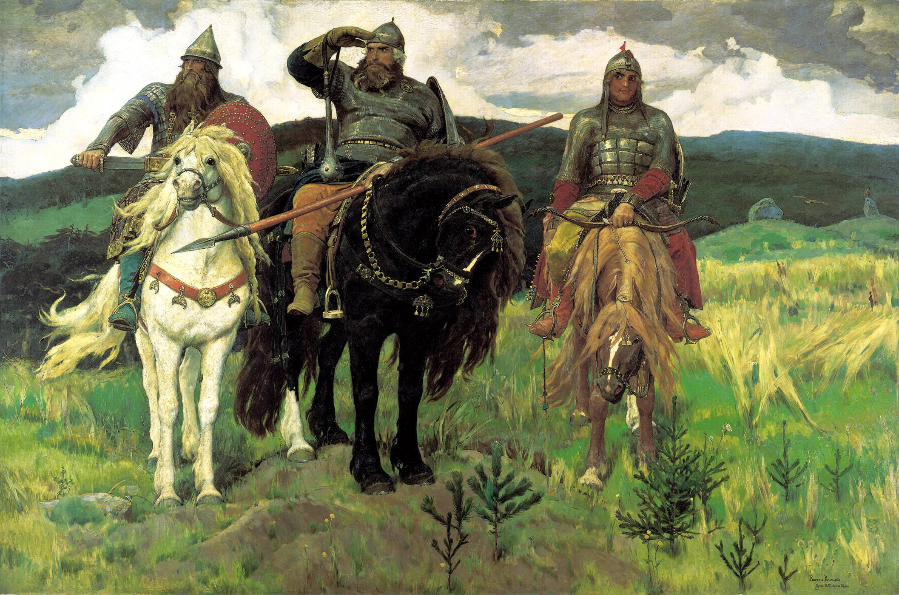
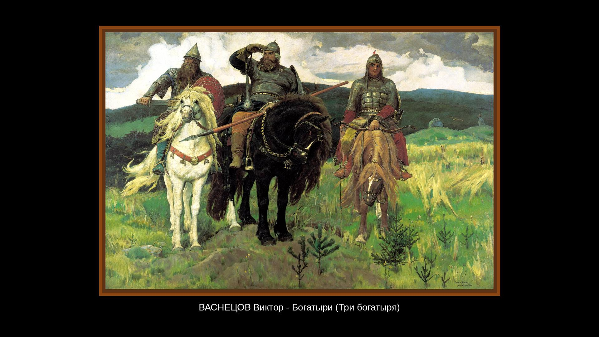

# 🖼️ Framed Wallpapers

**English** | [Русский](README.ru.md)

[](https://www.python.org/)
[](https://pypi.org/project/Pillow/)
[](#notes)
[](#license)

> Scripts for creating styled wallpapers with a wooden frame and captions from CSV, plus a utility to detect screen resolution.

---

## ✨ Features

|   | Feature | Description |
|---|---------|--------------|
| 🎨 | **Wallpaper generation** | Scale preserving aspect ratio, place on black canvas, add decorative frame and text caption |
| 📝 | **Batch processing** | Process multiple images with captions from a CSV file |
| 🖥️ | **Resolution detection** | Cross-platform detection of all connected monitors' resolution |

---

## 📁 Project structure

```
framed-wallpapers/
├── 🐍 image_text.py      # Wallpaper generation: frame + captions
├── 🐍 resolution.py      # Screen resolution utility
├── 📄 captions.csv       # Image captions
├── 📄 example_captions.csv  # Example caption format
├── 📂 input/             # Source images (.jpg, .jpeg)
├── 📂 output/            # Generated wallpapers (created automatically)
├── 📂 examples/          # Before/after samples
└── 📄 README.md
```

---

## 🔧 Requirements

- **Python 3.6+**
- [Pillow](https://pypi.org/project/Pillow/) — image processing
- [screeninfo](https://pypi.org/project/screeninfo/) — resolution detection *(optional, only for `resolution.py`)*

---

## 🚀 Quick start

### Installation

```bash
# Clone the repository
git clone https://github.com/<username>/framed-wallpapers.git
cd framed-wallpapers

# Create virtual environment
python -m venv venv
source venv/bin/activate        # Linux / macOS
# venv\Scripts\activate         # Windows

# Install dependencies
pip install Pillow screeninfo
```

### Wallpaper generation

| Before | After |
|--------|-------|
|  |  |

1. Put your source images (`.jpg`, `.jpeg`) in the **`input/`** folder.

2. Fill in **`captions.csv`** — one row per image, row order = alphabetical order of files. Example (**`example_captions.csv`**):

   ```csv
   caption
   "ВАСНЕЦОВ Виктор - Богатыри (Три богатыря)"
   "СЕРОВ Валентин - Девочка с персиками"
   "РЕПИН Илья - Пахарь (Л. Н. Толстой на пашне)"
   ```

3. Run the script:

   ```bash
   python image_text.py
   ```

4. Wallpapers will appear in **`output/`** with the `processed_` prefix 🎉

### ⚙️ Parameters

Configured in the `if __name__ == "__main__"` block of `image_text.py`:

| Parameter     | Default        | Description |
|---------------|----------------|-------------|
| `input_dir`   | `"input"`      | Folder with source images |
| `csv_path`    | `"captions.csv"` | Path to captions file |
| `output_dir`  | `"output"`     | Output folder |
| `target_size` | `(1920, 1080)` | Canvas size (W × H) |
| `font_size`   | `30`           | Caption font size |
| `padding`     | `10`           | Edge padding in pixels |
| `scale_factor`| `0.8`         | Image scale relative to available area |

Fonts: the script looks for Liberation Sans or DejaVu Sans on standard Linux paths. If not found, PIL's default font is used.

### 🖥️ Screen resolution

```bash
python resolution.py
```

The script tries three methods in order:

| # | Method      | Platform         | What it reports |
|---|-------------|------------------|-----------------|
| 1 | screeninfo  | Cross-platform   | All connected monitors |
| 2 | xrandr      | X11              | Active modes (marked with *) |
| 3 | xdpyinfo    | X11              | Primary display resolution |

**Example output:**

```
Получение разрешения экрана...

Метод 1: screeninfo
Монитор 1: 1920x1080
Монитор 2: 1280x800

Метод 2: xrandr
Монитор 1: 1920x1080
Монитор 2: 1280x800

Метод 3: xdpyinfo
Монитор 1: 3200x1239
```

---

## Notes

On Wayland, `xrandr` and `xdpyinfo` are typically not available; only the screeninfo method is used. If the number of captions in CSV does not match the number of images, the script prints a warning and uses a placeholder for missing captions.

## License

MIT (or specify your license).
